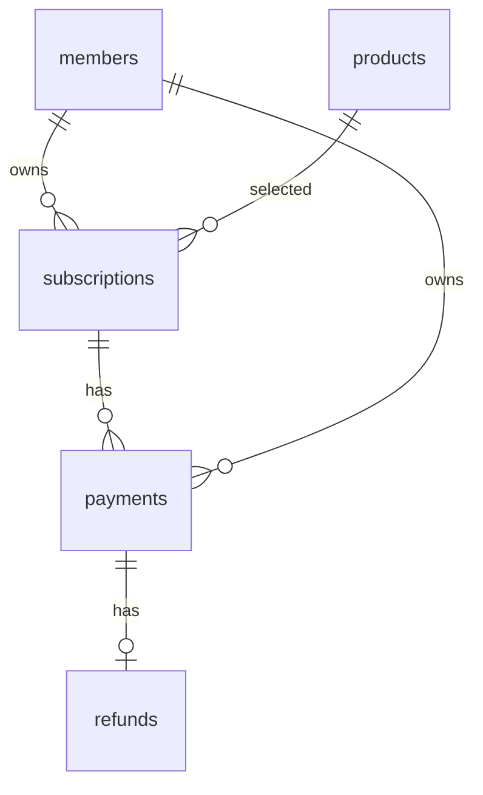

# DB / ERD 구현 계약

최초 DDL: backend/src/main/resources/db/subscription-schema.sql.
members/products는 상대 담당자가 먼저 생성해야 합니다. 이 DDL은 기존 테이블 갱신용 마이그레이션이 아닙니다.

원본 Subscription 1:N Payment를 유지하지만 이번 서비스는 최초 결제 1건만 생성합니다.

## 테이블

- subscriptions: subscription_id, member_id, product_id, status, start_date, end_date, cancelled_at, created_at, updated_at, version
- payments: payment_id, subscription_id, member_id, request_key, amount, payment_method, status, paid_at, created_at, version
- refunds: refund_id, payment_id, amount, reason, status, refunded_at, created_at, version

금액 DECIMAL(10,2), 상태 VARCHAR + EnumType.STRING, 날짜 DATE, 시점 TIMESTAMP.
payments.member_id/request_key 및 각 테이블 version은 원본 대비 추가 사항입니다.
Payment의 회원 ID는 연결된 Subscription의 회원 ID와 같아야 하며 서버 생성 로직이 이를 보장합니다.

## 제약 및 인덱스

- subscriptions(member_id,product_id,end_date), subscriptions(status,end_date)
- payments(member_id,request_key) UNIQUE
- refunds(payment_id) UNIQUE
- 모든 참조 FK, CASCADE DELETE 없음
- 상태/결제 수단 CHECK, 양수 금액 CHECK, end_date >= start_date CHECK

## 정책

1. 실패 결제는 FK 필수 조건을 지키기 위해 저장하지 않습니다. payment_attempts 도입은 공동 검토 대상입니다.
2. 이용 기간은 [startDate, endDate), 한국 시간 자정 기준입니다.
3. 월말·윤년은 LocalDate.plusMonths/plusYears를 사용합니다.
4. 전액 환불 승인 시 미래 endDate를 오늘로 단축하고 EXPIRED로 변경합니다.
5. 반려 후 재요청은 원본 결제당 환불 1회 제약으로 금지합니다.
6. JPA 기본 validate: 검토된 SQL을 먼저 적용합니다. update만 사용하면 FK/CHECK 생성은 보장되지 않습니다.
7. Member/Product Entity를 복제하지 않고 ID 참조 + 명시적 FK를 사용합니다.

## 상대 담당자 연결

CatalogGateway 읽기 계약:

- members: member_id BIGINT, email VARCHAR UNIQUE, role VARCHAR(USER/ADMIN)
- products: product_id BIGINT, name VARCHAR, price DECIMAL, billing_cycle VARCHAR(MONTHLY/YEARLY), status VARCHAR(ACTIVE/INACTIVE)

demo-catalog.sql은 demo/test 전용 최소 스키마이며 정식 회원·상품 테이블을 대체하지 않습니다.
